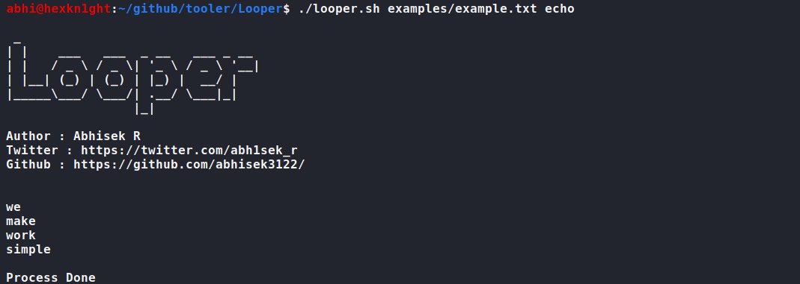

# Looper


### Just automate any command without writing any loops !
#### Installation
```
$ git clone
$ chmod +x looper.sh
```
#### Usage
```
./looper.sh [-h(help) | -q(quiet)] <path_to_wordlist> <pre_command> <post_command>
```
#### Examples




#### Contribution From
- [Abhisek R](https://www.linkedin.com/in/abhisek-r/)
