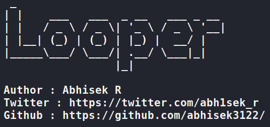
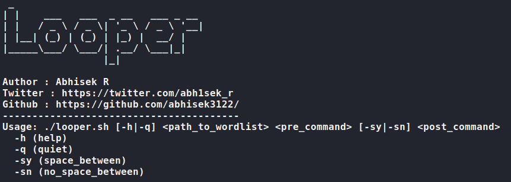
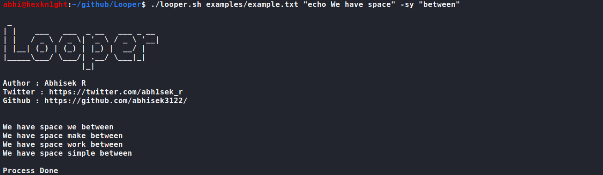
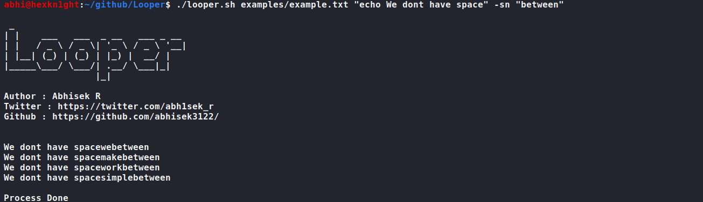

# Looper


### Just automate any command without writing loops !
#### Installation
```
$ git clone https://github.com/abhisek3122/Looper.git
$ chmod +x looper.sh
```
#### Usage
```
Usage: ./looper.sh [-h|-q] <path_to_wordlist> <pre_command> [-sy|-sn] <post_command>
  -h (help) : Details of the tool
  -q (quiet) : Banner will not be printed
  -sy (space_between) : Space will be given in between command
  -sn (no_space_between) : Space will not be given in between command

Do not forget to specify option [-sy | -sn]
```
#### Disclaimer
```
Author and Contributors are not responsible for any malpractices done with this
tool.
```
#### Working
```
Let's say you have a command that needs to be passed multiple times for
multiple arguments, You will write a loop to put the wordlist in. But
now just follow the looper syntax and save the time for writing the loop.

Example 1:
  Command: $anyTool -url example.com -A all
  Looper: $./looper <path_to_wordlist> "anyTool -url" -sy "-A all"

Example 2:
  Command: $curl http://anywebsiteHere.com?q=example.com
  Looper: $./looper <path_to_wordlist> "http://anywebsiteHere.com?q=" -sn
```
#### Examples
##### Help

##### Example File

##### Command with space

##### Command without space

##### Avoid banner


#### Contribution From
- [Abhisek R](https://www.linkedin.com/in/abhisek-r/)
